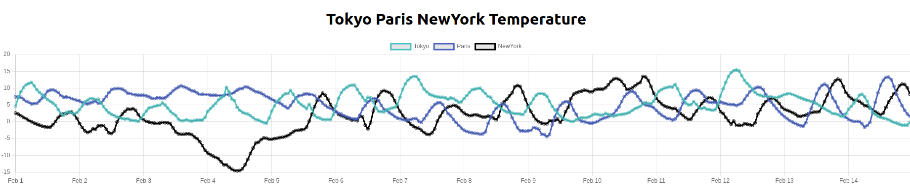

## 環境構築

本UIアプリケーションは、下記に示す2通りの環境構築方法を提供している。

どちらの方法でも結果は変わらないので任意の方法で実行するとよい。

### Reactの開発用サーバを用いる方法

1. `docker build -t <任意のタグ> .`を入力

2. `docker run -it --rm -v <本ディレクトリへのパス>:/app -p 3000:3000 <任意のタ>` を実行し、`localhost:3000`にブラウザでアクセスする。

### Reactアプリをビルドしてnginx経由でアクセスする方法

1. `docker build -t <任意のタグ> -f Dockerfile_Production .`

2. `docker run --rm -it -p 3000:80 weather-history-plot` を実行し、`localhost:3000`にブラウザでアクセスする。

## 動作確認

ブラウザに以下のような画面が表示される。

## 注意点

- 環境構築に記載したポートが使用中の場合は、「使用中のポートを開放する」, 「ホスト側に渡すポートを変更する(`-p 3000:3000` => `-p 8080:3000`にするなど)」
